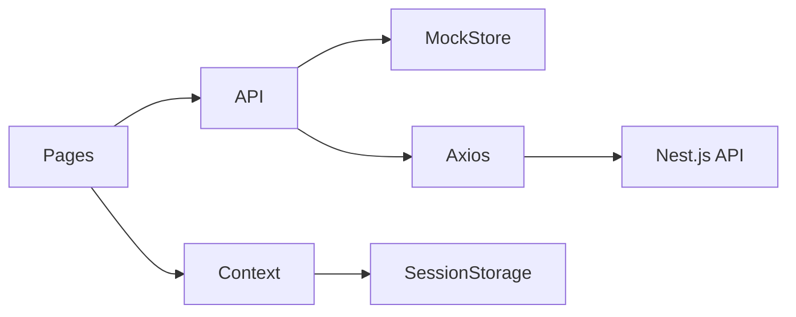

# Architecture

Printflow uses a flat, readable structure. Each folder has a single responsibility without heavy abstractions.

## Folder layout

```
src/
├── api/           HTTP layer (axios + mock fallback)
├── components/    Reusable UI (layout, orders, shadcn)
├── config/        Environment flags
├── context/       Auth and theme state
├── mocks/         JSON fixtures for offline demo
├── pages/         Route screens (Login, Orders, Dashboard, Settings)
├── types/         Domain interfaces (separate from pages)
├── utils/         Formatting, labels, storage helpers
└── test/          Vitest setup
```

## Data flow



1. Pages call functions in `src/api/*`.
2. When `VITE_USE_MOCK=true`, the API module delegates to `mock-store.ts`, which reads and mutates in-memory copies of JSON fixtures.
3. When mock is off, Axios sends requests to `VITE_API_URL` with `withCredentials: true` for cookie-based sessions (no JWT).

## Routing

| Path | Screen | Auth |
|------|--------|------|
| `/login` | Login | Public |
| `/orders` | Orders | Protected |
| `/dashboard` | Sales report | Protected |
| `/settings` | Theme and account | Protected |

`ProtectedRoute` redirects unauthenticated users to `/login`. Session is stored in `sessionStorage`.

## Orders refresh

The Orders page polls `fetchOrders` every 15 seconds and updates React state. Manual refresh is also available. Saving a card calls `updateOrder` and merges the response into local state without a full page reload.

## Theming

`ThemeProvider` toggles the `dark` class on `document.documentElement` and persists the choice in `localStorage`.

## Testing strategy

Vitest covers the mock store and API wrappers for:

- Authentication success and failure
- Order status and final value updates
- Sales report aggregation by period

UI integration tests are intentionally minimal to keep the suite fast and focused.
