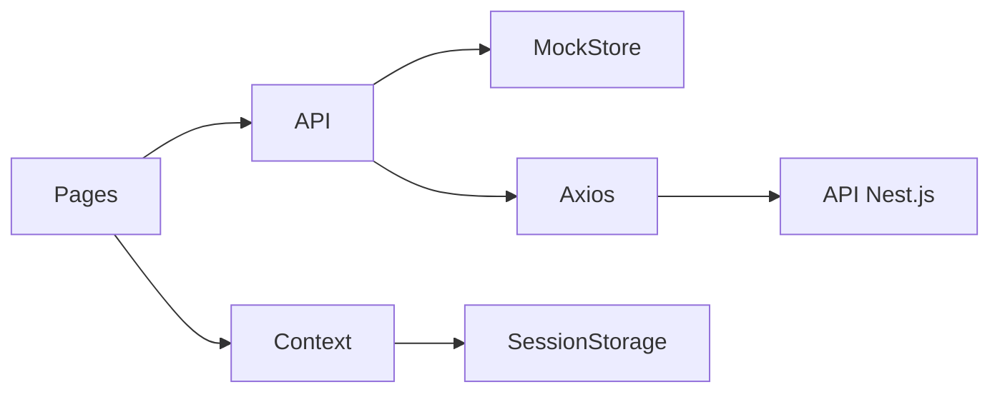

# Arquitetura

O Printflow usa uma estrutura plana e legível. Cada pasta tem uma responsabilidade única, sem abstrações pesadas.

## Organização de pastas

```
src/
├── api/           Camada HTTP (axios + fallback para mock)
├── components/    UI reutilizável (layout, pedidos, shadcn)
├── config/        Flags de ambiente
├── context/       Estado de autenticação e tema
├── mocks/         Fixtures JSON para demo offline
├── pages/         Telas de rota (Login, Orders, Dashboard, Settings)
├── types/         Interfaces de domínio (separadas das telas)
├── utils/         Formatação, rótulos, helpers de storage
└── test/          Setup do Vitest
```

## Fluxo de dados



1. As telas chamam funções em `src/api/*`.
2. Quando `VITE_USE_MOCK=true`, o módulo de API delega para `mock-store.ts`, que lê e altera cópias em memória dos JSONs de mock.
3. Com o mock desligado, o Axios envia requisições para `VITE_API_URL` com `withCredentials: true` para sessão via cookie (sem JWT).

## Rotas

| Caminho | Tela | Autenticação |
|---------|------|--------------|
| `/login` | Login | Pública |
| `/orders` | Pedidos | Protegida |
| `/dashboard` | Relatório de vendas | Protegida |
| `/settings` | Tema e conta | Protegida |

`ProtectedRoute` redireciona usuários não autenticados para `/login`. A sessão fica em `sessionStorage`.

## Atualização de pedidos

A tela de Pedidos consulta `fetchOrders` a cada 15 segundos e atualiza o estado do React. Também há atualização manual. Ao salvar um card, `updateOrder` é chamado e a resposta é mesclada no estado local sem recarregar a página.

## Tema

`ThemeProvider` alterna a classe `dark` em `document.documentElement` e persiste a escolha em `localStorage`.

## Estratégia de testes

O Vitest cobre o mock store e os wrappers da API para:

- Sucesso e falha na autenticação
- Atualização de status e valor final do pedido
- Agregação do relatório de vendas por período

Testes de integração de UI são propositalmente mínimos para manter a suíte rápida e focada.
